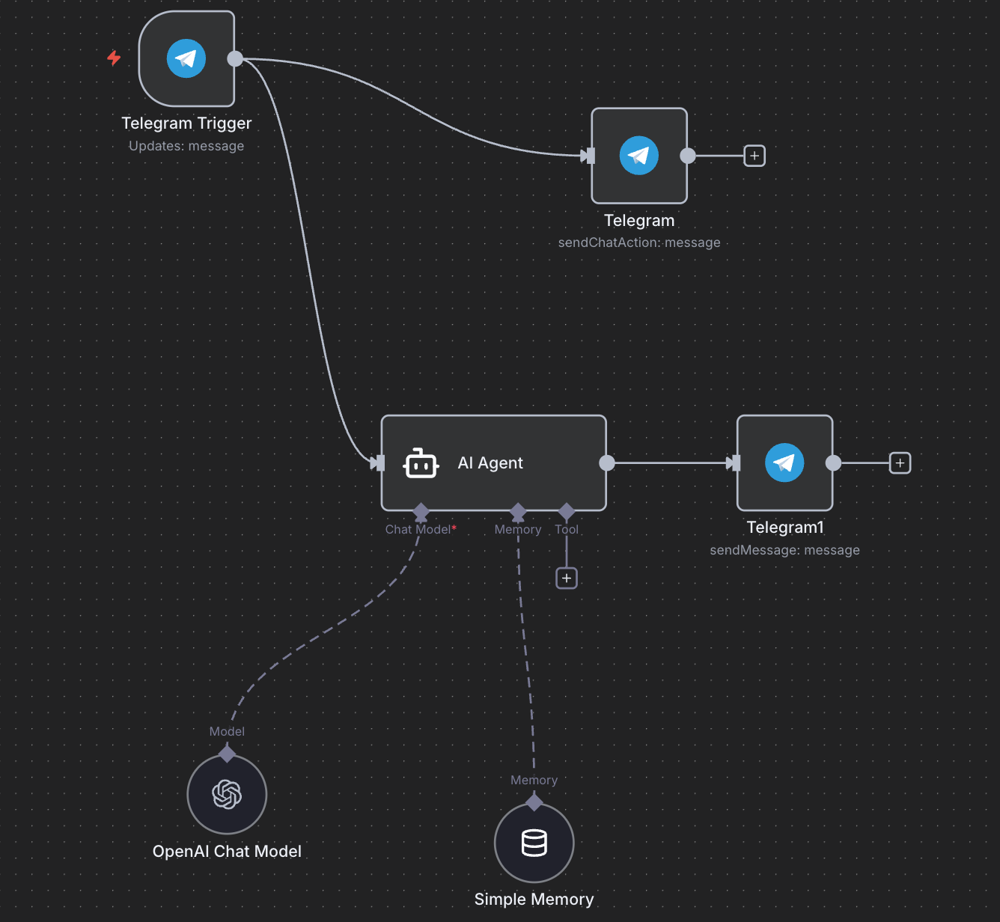

#  ИИ-агент для выбора специализации  
Telegram-бот на n8n с проактивным AI-агентом (GigaChat 2)

Этот проект — мой первый проактивный ИИ-агент, собранный в n8n.  
Бот задаёт пользователю серию вопросов, анализирует ответы и выдаёт рекомендацию по выбору специализации внутри выбранного направления обучения.  

Бот использует собственный системный промпт, хранит контекст через SimpleMemory и работает на модели **GigaChat 2**, превращаясь из обычного LLM в полноценного агента.

---

## 📎 Функциональность

### 1. Диалоговый Telegram-бот
После запуска бот:

- приветствует пользователя;
- объясняет цель — помочь выбрать специализацию;
- последовательно задаёт вопросы:
  - предыдущий опыт и достижения;
  - опыт прохождения отбора (обезличенный);
  - что нравится в направлении;
  - какой тип задач комфортнее;
  - формат работы;
  - какие навыки хочется развивать дальше.

Все ответы сохраняются в отдельную память конкретного пользователя (через SimpleMemory).

---

### 2. Проактивная логика AI-агента
AI-агент в ноде **AI Agent** использует:

- системный промпт с целью и правилами поведения;
- GigaChat Model (GigaChat 2);
- SimpleMemory для хранения контекста диалога.

На основе всех ответов агент:

- строит профиль пользователя,
- сопоставляет навыки и предпочтения с направлениями,
- формирует итоговую рекомендацию.

Пример результата:  
_«Тебе больше подходит бэкенд на Python: ты любишь сложную логику, предпочитаешь системные задачи и уже имеешь опыт написания алгоритмов.»_

---

### 3. Защита данных

- бот не передаёт личные данные;
- ответы обезличиваются;
- внешнее API GigaChat получает только обезличенные данные.

---

## 🧠 Используемые технологии

- n8n  
- Telegram Trigger / Telegram Send Message  
- AI Agent  
- GigaChat 2  
- SimpleMemory  

---

## 🚀 Запуск проекта

1. Создать Telegram-бота через `@BotFather` и получить токен.  
2. Импортировать `task2_agent.json` в n8n.  
3. Настроить параметры:
   - BOT_TOKEN  
   - SimpleMemory (режим “per chat”)  
   - GigaChat credentials  
4. В ноде **AI Agent** вставить системный промпт (описан в `task3.txt`).  
5. Активировать workflow.  
6. Написать боту и пройти серию вопросов.  

После завершения диалога бот автоматически отправляет итоговую рекомендацию.

---

## 📌 Итог

Проект реализует полноценного **проактивного AI-агента**, который:

- ведёт диалог,  
- собирает ответы,  
- хранит контекст,  
- анализирует предпочтения,  
- выдаёт рекомендацию по специализации.

Это шаг к созданию персональных интеллектуальных ассистентов на базе n8n и GigaChat.
