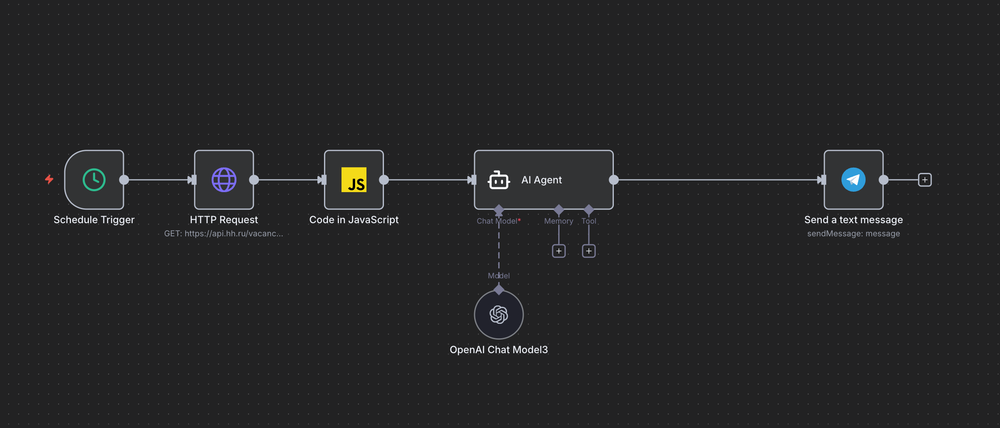

# AI-бот для автоматической рассылки новостей и анализа вакансий

Этот проект представляет собой полностью автоматизированного AI-агента, собранного в n8n.  
Он ежедневно присылает дайджест новостей по выбранной тематике и раз в неделю анализирует вакансии на рынке труда, формируя аналитический отчёт.  
Оба типа отчётов отправляются в один приватный Telegram-канал, который служит личным помощником и источником актуальной информации.

---

## 📎 Функциональность

### 1. Ежедневный новостной дайджест (каждый день в 11:00)
Бот собирает данные из нескольких Telegram-каналов, конвертированных в RSS.  
Каждый день в 11:00 он:

- получает новые посты из 3 тематических Telegram-каналов;
- использует модель **GigaChat-2** для суммаризации каждого поста;
- генерирует общее summary дня;
- оформляет структурированный дайджест:
  - общее описание всех постов;
  - далее по каждому каналу: название, количество постов, краткие описания и ссылки;
- отправляет итоговый дайджест в мой приватный Telegram-канал.

Это позволяет получать структурированную сводку новостей без необходимости вручную читать все источники.

---

### 2. Еженедельный анализ вакансий (каждое воскресенье)
Раз в неделю бот:

- обращается к API HH.ru;
- парсит N свежих вакансий по выбранному направлению и региону;
- извлекает ключевые требования из описаний вакансий;
- агрегирует статистику: формирует топ-15 наиболее частых навыков;
- использует AI-агента на **GigaChat-2.1** для нормализации навыков (python/Python → python);
- собирает отчёт вида:

_«На этой неделе я спарсил N свежих вакансий. Самые популярные требования:  
• навык — количество раз  
• навык — количество раз  
• …»_

- отправляет итоговый отчёт каждое воскресенье в тот же приватный Telegram-канал.

Таким образом, один и тот же канал служит как персональная новостная лента, так и инструмент анализа рынка труда.

---

## 🧠 Используемые технологии

- **n8n** — оркестрация и автоматизация процессов  
- **GigaChat-2.1** — суммаризация и анализ данных  
- **RSS-прокси для Telegram** — получение постов из публичных Telegram-каналов  
- **API HH.ru** — парсинг вакансий  
- **Telegram Bot API** — отправка сообщений  
- **AI-агент с инструментами** — для анализа, поиска и суммаризации

---

## 🚀 Запуск проекта

1. Установить n8n по инструкции.  
2. Импортировать `News digest.json и HHru job.json` в n8n.  
3. После импорта убедись, что настроены следующие параметры:

- Telegram Bot Token — токен бота, полученный через @BotFather.  
- Chat ID приватного Telegram-канала, куда будут отправляться сообщения.
- API-ключи (если в workflow используются внешние сервисы).

Важно: если сообщения не приходят, проверь корректность BOT_TOKEN, CHAT_ID и что workflow активирован.

4. Настрой расписание:
   В workflow встроены два Cron-триггера:

- ежедневный дайджест — каждый день в **11:00**  
- еженедельный анализ вакансий — каждое **воскресенье**

Изменить время можно в узлах:

```
Schedule → Cron
``` 
5. Активировать воркфлоу.  
6. Проверь Telegram-канал.
   Все результаты приходят в **один приватный Telegram-канал**.

Если сообщений нет — проверь:

- правильность `CHAT_ID`  
- правильность `BOT_TOKEN`  
- что workflow активирован 

---



## 📌 Итог

Проект объединяет два больших задания в одного AI-агента, который:

- каждый день в **11:00** отправляет дайджест новостей;  
- каждое **воскресенье** присылает анализ вакансий;  
- использует один приватный Telegram-канал;  
- работает полностью автономно.

Это персональный аналитический помощник, созданный на базе n8n и GigaChat.
