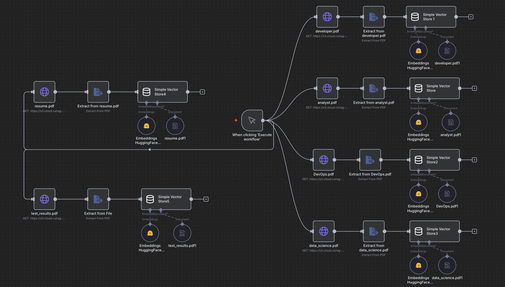
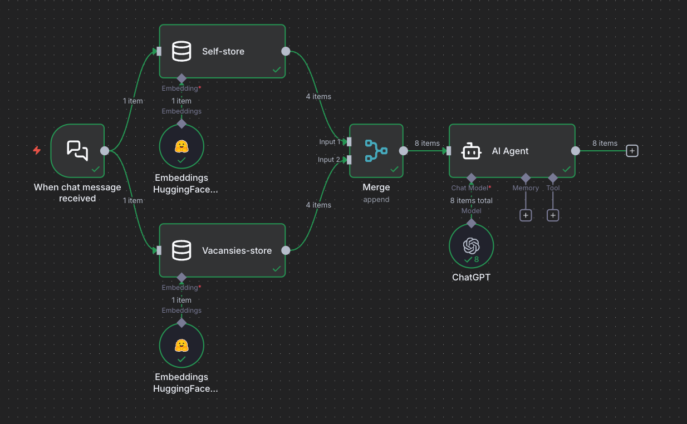

# 🚗 Базовая RAG-система в n8n  
**AI-агент для анализа вакансий, резюме и личностного профиля**

Этот проект — минимальная, но полноценная базовая RAG-система, собранная в n8n.  
Она состоит из двух хранилищ: первое — набор PDF-вакансий разных профилей, второе — резюме и результаты личностного опросника.  
Система позволяет задать вопрос на естественном языке и получить осмысленный ответ, основанный на загруженных документах.

В основе используется векторное хранилище **Simple Vector Store**, модель эмбеддингов **ru-en-RoSBERTa** и генеративная модель **GigaChat 2**.

---

## 📎 Функциональность

### **1. Загрузка и индексация PDF-документов**  
Внутри workflow реализована логика:

- загрузки PDF-файлов с компьютера;  
- извлечения текста из PDF;  
- преобразования текста в эмбеддинги;  
- сохранения их в векторное хранилище Simple Vector Store.

Проект использует два отдельных хранилища:

**Хранилище №1 — вакансии**  
Сюда загружается 4–5 PDF с описаниями вакансий разных профилей (разработчик, аналитик, UX-дизайнер и т.д.).

**Хранилище №2 — личные данные пользователя**  
Содержит резюме и PDF-файл с результатами личностного опросника о сильных сторонах.

---

### **2. Генерация ответов через GigaChat 2**  
После индексации документов можно задавать вопросы:

- «Какая вакансия лучше подходит под мой профиль?»  
- «Какие стороны из опросника совпадают с требованиями вакансий?»  
- «Что мне стоит улучшить, чтобы откликаться на позицию X?»  

Ответ формируется на основе:

- релевантных фрагментов из векторной базы,  
- полученного контекста,  
- модели GigaChat 2.

---

### **3. Логика запроса и формирования ответа**  
В workflow настроен нод **On Chat Message**, который запускает процесс:

1. принимает вопрос от пользователя;  
2. ищет релевантные фрагменты в векторном хранилище;  
3. передаёт найденный контекст в GigaChat 2;  
4. получает итоговый ответ и отправляет его пользователю.

Релевантность ответа можно тестировать и улучшать, изменяя параметры.

---

## 🧠 Используемые технологии

- **n8n**
- **Simple Vector Store**
- **PDF Extract / Document Extract**
- **HuggingFace + ru-en-RoSBERTa** (эмбеддинги)
- **GigaChat 2** (генерация)
- **On Chat Message Trigger**

---

## 🚀 Запуск проекта

1. Подготовить документы:  
   - 4–5 PDF-вакансий,  
   - резюме,  
   - PDF с результатами личностного опросника. [Пройти опрос](https://www.gptbots.ai/s/csWnj5nS)

2. Загрузить PDF-файлы в n8n через узел *Read Binary File / Upload*.

3. Передать документы в Simple Vector Store для преобразования в эмбеддинги.

4. Настроить модель эмбеддингов:  
   - зарегистрироваться на HuggingFace,  
   - получить API-ключ,  
   - выбрать модель `ru-en-RoSBERTa`.

5. Настроить генеративную модель GigaChat 2.

6. Добавить триггер **On Chat Message** для обработки запросов.

7. Протестировать ответы и убедиться в их релевантности.

---

### Загрузка данных в векторные хранилища

### Взаимодействие с GigaChat-2

---

## 📌 Итог

Проект — это рабочая базовая RAG-система, в которой:

- загружаются и индексируются PDF-документы,  
- создаётся собственная векторная база,  
- запросы проходят через поиск,  
- GigaChat 2 формирует ответ на основе реальных данных,  
- система помогает анализировать соответствие между вакансиями, резюме и личностными качествами.

Это шаг к созданию собственных интеллектуальных рекомендательных систем на базе n8n и GigaChat.
